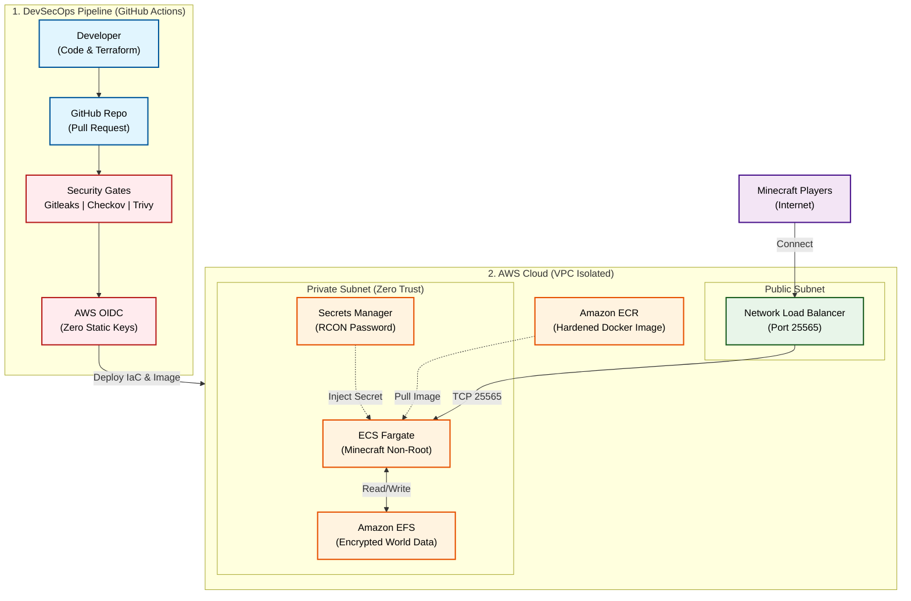

```mermaid
flowchart TD
    classDef dev fill:#e1f5fe,stroke:#01579b,stroke-width:2px,color:#000
    classDef sec fill:#ffebee,stroke:#b71c1c,stroke-width:2px,color:#000
    classDef awsPublic fill:#e8f5e9,stroke:#1b5e20,stroke-width:2px,color:#000
    classDef awsPrivate fill:#fff3e0,stroke:#e65100,stroke-width:2px,color:#000
    classDef player fill:#f3e5f5,stroke:#4a148c,stroke-width:2px,color:#000

    subgraph CI_CD ["1. DevSecOps Pipeline (GitHub Actions)"]
        direction TB
        Dev["Developer<br/>(Code & Terraform)"]:::dev
        Git["GitHub Repo<br/>(Pull Request)"]:::dev
        Scan["Security Gates<br/>Gitleaks | Checkov | Trivy"]:::sec
        OIDC["AWS OIDC<br/>(Zero Static Keys)"]:::sec

        Dev --> Git --> Scan --> OIDC
    end

    subgraph AWS ["2. AWS Cloud (VPC Isolated)"]
        direction TB
        ECR["Amazon ECR<br/>(Hardened Docker Image)"]:::awsPrivate
        
        subgraph Public_Sub ["Public Subnet"]
            NLB["Network Load Balancer<br/>(Port 25565)"]:::awsPublic
        end

        subgraph Private_Sub ["Private Subnet (Zero Trust)"]
            ECS["ECS Fargate<br/>(Minecraft Non-Root)"]:::awsPrivate
            EFS["Amazon EFS<br/>(Encrypted World Data)"]:::awsPrivate
            SecMgr["Secrets Manager<br/>(RCON Password)"]:::awsPrivate
        end

        ECR -.->|Pull Image| ECS
        NLB -->|TCP 25565| ECS
        ECS <-->|Read/Write| EFS
        SecMgr -.->|Inject Secret| ECS
    end

    Player["Minecraft Players<br/>(Internet)"]:::player

    OIDC -->|Deploy IaC & Image| AWS
    Player -->|Connect| NLB
```
