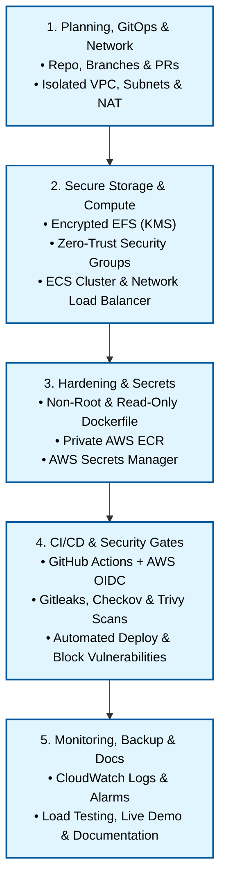

```mermaid
flowchart TD
    classDef step fill:#e1f5fe,stroke:#01579b,stroke-width:2px,color:#000

    S1["1. Planning, GitOps & Network<br/>• Repo, Branches & PRs<br/>• Isolated VPC, Subnets & NAT"]:::step
    S2["2. Secure Storage & Compute<br/>• Encrypted EFS (KMS)<br/>• Zero-Trust Security Groups<br/>• ECS Cluster & Network Load Balancer"]:::step
    S3["3. Hardening & Secrets<br/>• Non-Root & Read-Only Dockerfile<br/>• Private AWS ECR<br/>• AWS Secrets Manager"]:::step
    S4["4. CI/CD & Security Gates<br/>• GitHub Actions + AWS OIDC<br/>• Gitleaks, Checkov & Trivy Scans<br/>• Automated Deploy & Block Vulnerabilities"]:::step
    S5["5. Monitoring, Backup & Docs<br/>• CloudWatch Logs & Alarms<br/>• Load Testing, Live Demo & Documentation"]:::step

    S1 --> S2 --> S3 --> S4 --> S5
```
