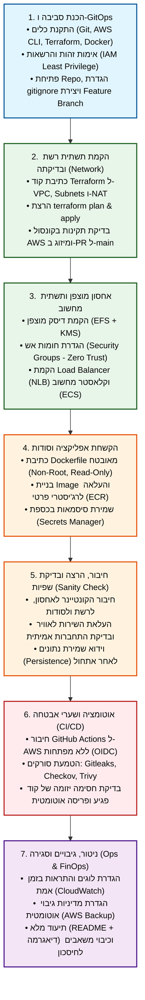

```mermaid
flowchart TD
    classDef setup fill:#e1f5fe,stroke:#01579b,stroke-width:2px,color:#000
    classDef infra fill:#e8f5e9,stroke:#1b5e20,stroke-width:2px,color:#000
    classDef app fill:#fff3e0,stroke:#e65100,stroke-width:2px,color:#000
    classDef sec fill:#ffebee,stroke:#b71c1c,stroke-width:2px,color:#000
    classDef ops fill:#f3e5f5,stroke:#4a148c,stroke-width:2px,color:#000

    P1["1. הכנת סביבה ו-GitOps<br/>• התקנת כלים (Git, AWS CLI, Terraform, Docker)<br/>• אימות זהות והרשאות (IAM Least Privilege)<br/>• פתיחת Repo, הגדרת gitignore ויצירת Feature Branch"]:::setup

    P2["2. הקמת תשתית רשת ובדיקתה (Network)<br/>• כתיבת קוד Terraform ל-VPC, Subnets ו-NAT<br/>• הרצת terraform plan & apply<br/>• בדיקת תקינות בקונסול AWS ומיזוג ב-PR ל-main"]:::infra

    P3["3. אחסון מוצפן ותשתית מחשוב<br/>• הקמת דיסק מוצפן (EFS + KMS)<br/>• הגדרת חומות אש (Security Groups - Zero Trust)<br/>• הקמת Load Balancer (NLB) וקלאסטר מחשוב (ECS)"]:::infra

    P4["4. הקשחת אפליקציה וסודות<br/>• כתיבת Dockerfile מאובטח (Non-Root, Read-Only)<br/>• בניית Image והעלאה לרג'יסטרי פרטי (ECR)<br/>• שמירת סיסמאות בכספת (Secrets Manager)"]:::app

    P5["5. חיבור, הרצה ובדיקת שפיות (Sanity Check)<br/>• חיבור הקונטיינר לאחסון, לרשת ולסודות<br/>• העלאת השירות לאוויר ובדיקת התחברות אמיתית<br/>• וידוא שמירת נתונים (Persistence) לאחר אתחול"]:::app

    P6["6. אוטומציה ושערי אבטחה (CI/CD)<br/>• חיבור GitHub Actions ל-AWS ללא מפתחות (OIDC)<br/>• הטמעת סורקים: Gitleaks, Checkov, Trivy<br/>• בדיקת חסימה יזומה של קוד פגיע ופריסה אוטומטית"]:::sec

    P7["7. ניטור, גיבויים וסגירה (Ops & FinOps)<br/>• הגדרת לוגים והתראות בזמן אמת (CloudWatch)<br/>• הגדרת מדיניות גיבוי אוטומטית (AWS Backup)<br/>• תיעוד מלא (README + דיאגרמה) וכיבוי משאבים לחיסכון"]:::ops

    P1 --> P2 --> P3 --> P4 --> P5 --> P6 --> P7

```
